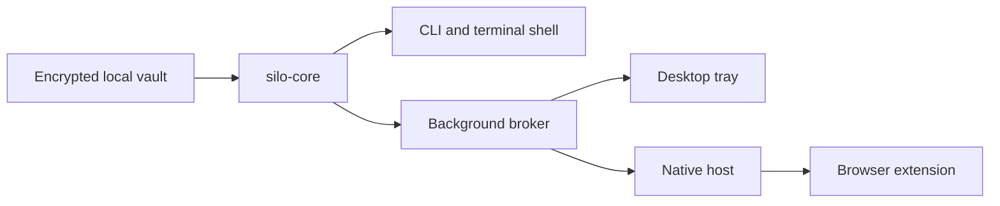

# Silo

Silo is a local-first password manager built in Rust. It keeps the vault on your machine and makes every release of a secret an explicit action.

[Download the latest release](https://github.com/Vic-Orlands/Silo/releases/latest) · [Architecture](https://github.com/Vic-Orlands/Silo/blob/main/docs/_posts/2026-08-05-silo-architecture.md) · [Security hardening](https://github.com/Vic-Orlands/Silo/blob/main/docs/security-hardening.md)


## Why Silo exists

Many password managers begin with an account and synchronization service. Silo begins with a local encrypted file. The CLI, terminal workspace, desktop tray, and browser bridge all operate around that vault without requiring a cloud account or sync layer.

The project is also an exploration of explicit secret access: metadata can be inspected without displaying a password, copy operations clear themselves, the browser receives only approved fields, and background sessions return to a locked state after inactivity.

## Product surfaces

- Focused CLI commands for creating, reading, updating, importing, and exporting entries
- Full-screen terminal workspace with search, keyboard navigation, and short-lived copy actions
- Background broker that owns an unlocked session and enforces inactivity timeouts
- Cross-platform tray companion for locking, unlocking, and opening the vault
- Browser extension and native-messaging bridge with explicit approval flows
- TOTP storage, generation, migration, and diagnostics
- Import support for Silo, Bitwarden, 1Password, KeePass, and common browser exports
- Signed release artifacts for macOS, Linux, and Windows

## Architecture



| Crate | Responsibility |
| --- | --- |
| `silo-core` | Vault model, file format, encryption, URL matching, and TOTP |
| `silo-cli` | Commands, prompts, terminal workspace, and user-facing behaviour |
| `silo-broker` | Unlocked local session, timeout, lock state, and browser-request policy |
| `silo-protocol` | Versioned messages shared by the broker and native host |
| `silo-native-host` | Native-messaging bridge between the browser and broker |
| `silo-tray` | Cross-platform tray process that owns the broker lifecycle |

## Security model

- Argon2id derives the vault key from the master password.
- ChaCha20-Poly1305 provides authenticated encryption for the vault payload.
- Sensitive values use explicit zeroization where the implementation permits it.
- Saves are atomic and preserve the previous vault as a backup.
- The broker clears decrypted state and the master password when it locks or exits.
- The browser extension never receives the master password.
- Clipboard contents are cleared after a short timeout only when another application has not replaced them.
- Release workflows publish SHA-256 checksums and Cosign signatures.
- CI runs workspace tests, dependency auditing, packaging checks, browser smoke tests, and dedicated fuzz targets.

Read [`docs/security-hardening.md`](./docs/security-hardening.md) for the security boundaries and remaining work.

## Install

Download the archive for your platform from the [latest release](https://github.com/Vic-Orlands/Silo/releases/latest):

- `aarch64-apple-darwin` for Apple silicon Macs
- `x86_64-unknown-linux-gnu` for 64-bit Linux
- `x86_64-pc-windows-msvc` for 64-bit Windows

Each release includes checksums and a Cosign signature. Verify downloaded artifacts with the repository’s [`cosign.pub`](./cosign.pub) key before installing them.

## Start a vault

```bash
silo --vault "$HOME/silo.vault" init
silo --vault "$HOME/silo.vault" add github --url https://github.com --username you@example.com
silo --vault "$HOME/silo.vault" shell
```

Run `silo --help` or `silo <command> --help` for the complete command reference.

## Build and verify from source

```bash
cargo fmt --all --check
cargo test --workspace
sh scripts/verify.sh
sh scripts/test-packaging.sh
sh scripts/browser-smoke.sh
```

Fuzz targets for vault and TOTP input live in [`fuzz`](./fuzz).

## Documentation

- [Architecture](./docs/_posts/2026-08-05-silo-architecture.md)
- [Secret lifecycle hardening](./docs/_posts/2026-08-02-secret-lifecycle-hardening.md)
- [Building the tray companion](./docs/_posts/2026-08-03-building-silo-tray.md)
- [Importing passwords](./docs/_posts/2026-08-04-importing-passwords-into-silo.md)
- [Security hardening](./docs/security-hardening.md)

## Security notice

Silo is pre-release software and has not undergone an independent security audit. Do not use it as the only password manager for important accounts until its memory handling, backups, locking behaviour, browser integration, update path, and security testing have been independently reviewed.

## License

MIT
